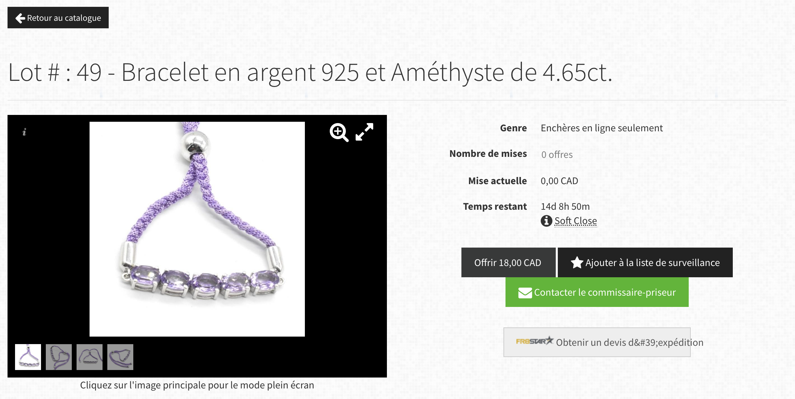

#Analyse du devis

---

## Compréhension du mandat
Lord Stampee, philatéliste de renom, souhaite amorcer sa transition numérique et développer une plateforme en ligne d'enchères de timbres. Les principaux objectifs de cette plateforme sont :
- être accessible de façon internationale et sur tous types d'appareils ;
- offrir un espace dédié ainsi que des fonctionnalités exclusives aux membres inscrits et connectés ;
- rechercher facilement un timbre selon de multiples critères, dans les enchères actives et/ou archivées ;
- enchérir sur un timbre (utilisateur identifié uniquement) ; 
- accéder à toutes les enchères actives et aux détails des timbres sans forcément avoir de critères de recherche précis ;
- offrir une interface familière et facile d'utilisation aux collectionneurs de timbres et aux amateurs d'enchères ;
- faire ressortir le standing du Lord en reprenant les couleurs de son blason familial qui sont le bleu et le rouge.

---

## Fonctionnalités envisagées
#### - Compte membre
Offrir la possibilité à un utilisateur de se créer un compte et de se connecter à ce compte via la plateforme.
Le membre une fois connecté peut accéder à certaines fonctionnalités comme placer une enchère et accéder à son espace membre où il retrouvera des informations propres à son historique d'enchérisseur.

Requis pour se connecter :
    - Informations d'authentification (nom, prénom, pseudo, adresse-mail) ;
    - Informations bancaires (empreinte du moyen de paiement valide) ;
    - Formulaire données personnelles RGPD.

Fonctionnalités du compte membre :
    - Enchérir sur un timbre (voir la fonctionnalité Placer des offres) ;
    - Ajouter des timbres dans une liste de favoris / à surveiller ;
    - S'abonner à l'infolettre des membres.

Espace membre :
    - Accès à ses informations personnelles (identification et bancaires) ;
    - Accès à la liste des timbres aimés/suivis et leur information d'enchère ;
    - Accès à l'historique des offres et l'historique des achats ;
    - Accès aux recherche enregistrées.

Cette fonctionnalité implique que tous les CTA ou emplacement réservés aux activités du membre soit remplacés par des appels à la connexion au compte quand un utilisateur n'est pas connecté. Le fait de rendre visible ainsi les fonctionnalités qui ne sont pas encore débloquées pourra inciter l'utilisateur à se créer un compte. Le site reste cependant complètement accessible à un utilisateur non connecté, celui-ci ne pourra juste pas enchérir et accéder aux fonctionnalités citées plus haut.

**Fonctionnalité complémentaire** : Ajouter la possibilité pour un membre de créer sa collection personnelle de timbre dans son espace personnel. Voir section 'Question au client' pour plus de détail. 

**Fonctionnalité complémentaire** : Ajouter la possibilité pour un membre de rentrer en communication avec d'autres membres. Voir section 'Question au client' pour plus de détail.

**Fonctionnalité complémentaire** : Ajouter la possibilité pour un membre d'enregistrer ses recherches et de les retrouver dans son espace membre.
 

#### - Rechercher un timbre
La plateforme devra offrir la possibilité de faire une recherche selon des mots-clés libres et/ou des critères spécifiques à définir. 
La recherche libre devra permettre au membre d'entrer un ou des mots-clés dans une barre de recherche et accéder à une page de résultat présentant une correspondance de ces mots-clés dans le titre ou la description du timbre. 

Une recherche par filtres sera offerte également en plus de la recherche libre. Elle proposera aux membres de filtrer la liste des résultats selon les critères suivants :
- Pays d'origine : 5 à 10 pays, plus une catégorie Autre (à définir selon le catalogue du client) ;
- Année de publication : 5 à 10 fourchettes pertinentes (à définir selon le catalogue du client) ;
- Condition : 5 états (parfaite, excellente, bonne, moyenne, endommagé) ;
- Thématique / Sujet : 5 à 10 thématiques et sujets (à définir selon le catalogue ou la classification existante du client) ;
- Prix : 5 à 10 fourchettes pertinentes (à définir selon le catalogue du client) ;
- État de l'enchère : à venir, active ou archivée ;
- Timbre rare ;
- Timbre coup de coeur du Lord.

La recherche libre sera accessible en tout temps sur toutes les pages de la plateforme via une barre de recherche.

La recherche par filtres sera quant à elle disponible uniquement dans la page catalogue pour filtrer les résultats. Dans cette page catalogue, il sera également possible de trier les résultats selon la date de fin d'enchère ou le prix.
 

#### - Placer une offre
À partir du moment où l'utilisateur est connecté à son compte, il peut placer une offre sur le timbre de son choix, que ce soit via la page de détail du timbre ou directement via la vue du catalogue.

Miser sur un timbre se fera de la manière traditionnelle sur ce genre de site d'enchère. Le membre peut placer une première mise qui correspond au montant minimum demandé pour se présenter comme l'enchérisseur gagnant. Il peut également placer un montant maximum pour que les enchères montent automatiquement jusqu'à ce que ce maximum soit atteint. À chaque fois que son enchère augmente ou une fois que sa mise maximum est dépassée, le membre reçoit une notification par mail. Le membre peut également retrouver l'historique de ses offres en cours, ses enchères terminées et ses achats à partir de son espace en ligne.

Si l'enchère est remportée, le membre a un certain délai pour payer sa facture (délai à convenir avec le client) et choisir le mode d'envoi de sa commande. 
 

#### - Voir les timbres
Les timbres présentés aux enchères devront tous avoir des images en haute définition accessibles depuis la page de description du timbre. Les détails et la qualité visuelle des timbres étant très importants pour les futurs enchérisseurs, nous donneront la possibilité de zoomer à l'intérieur des images pour que chacun puisse être en mesure de savoir exactement ce sur quoi il est en train d'enchérir. 
Cette fonctionnalité se veut la remplaçante de la bonne vieille loupe, chère aux membres du club.
 

#### - Naviguer simplement
Afin de ne pas avoir un seul menu trop chargé et perdre l'utilisateur dans des sous-sous-menu, nous proposons une navigation éclatée sur plusieurs emplacements stratégiques et avec plusieurs niveaux. 

Voici les différents menus et leur emplacement :
- Menu supérieur : Langue, Connexion / Création compte / Mon compte. Reste visible sur toutes les pages dans la partie supérieur en entête.
- Menu principal : Accueil, Enchères, Vendre, barre de Recherche. Reste visible sur toutes les pages dans la partie supérieure.
- Menu secondaire : À propos, FAQ, Contact. Reste visible sur toutes les pages dans la partie inférieure en pied-de-page.
- Menu contextuel : Un menu contextuel à chaque page sera également disponible sur la partie gauche et l'utilisateur pourra naviguer à travers les différentes sections d'une page via un fil d'ariane. Voir l'arborescence structurelle pour plus de détails.

**Fonctionnalité complémentaire** : afin de rendre la navigation fluide dans des pages qui peuvent vite être chargées en contenu, un bouton de retour en haut de page sera disponible sur toutes les pages.

**Fonctionnalité complémentaire** : pour que l'utilisateur sache toujours où il se trouve dans l'arborescence du site, un fil d'ariane sera présent et cliquable pour revenir en arrière.
 

#### - Consulter les archives
La fonctionnalité de recherche intègre le fait de pouvoir rechercher dans les enchères courantes mais également dans celles archivées. Par défaut ce sont les archives courantes uniquement qui sont affichées dans les résultats de recherche. Cependant, l'utilisateur pourra choisir de sélectionner uniquement les enchères archivées à partir de la recherche par filtre pour accéder au catalogue entier de ces enchères passées. Comme pour les enchères actives, l'utilisateur pourra également accéder aux fiches détaillées des timbres.
 

#### - Éditorialiser les enchères
Afin de proposer une autre manière de découvrir les timbres offerts aux enchères que seulement par la recherche, nous proposons de rendre disponible à partir de la page d'accueil des mises de l'avant d'enchères de façon éditorialisée par les administrateurs du site. On retrouvera dans cette section :
- les enchères à venir ;
- les nouvelles enchères ;
- les enchères rares (une icône accompagnera les timbres de cette sélection dans toutes les pages où on les retrouvera) ;
- des mises de l'avant de timbres en vente selon des thématiques ponctuelles ;
- des mises de l'avant des coups de coeur du lord Stampee, les timbres à ne pas manquer (une icône accompagnera les timbres de cette sélection dans toutes les pages où on les retrouvera).

Sélectionner une de ces mises de l'avant dirigera l'utilisateur vers la page de résultats de recherche mais avec les critères de filtre présélectionnés. C'est une manière en quelque sorte de suggérer à l'utilisateur des façons de rechercher des timbres.

---

## Arborescence structurelle

---

## Questions au client / Ce qu’il reste à établir
1. **Espace client** : voulez-vous offrir aux membres la possibilité de communiquer entre eux ? Cette option pourrait se traduire de plusieurs manières, dans un espace dédié public, et/ou dans leur espace privée et donc de manière privée.
 

2. **Espace client** : voulez-vous offrir aux membres la possibilité de se créer sa collection de timbres privés à partir de son espace en ligne ? (ref [discogs](https://www.discogs.com)) Ici encore, plusieurs manières d'imaginer cette fonctionnalité. Strictement, en ajoutant à sa collection les timbres acquis uniquement via la plateforme Stampee. Ou plus largement, en laissant la possibilité aux membres d'ajouter des timbres à sa collection qu'ils aient été acquis via Stampee ou non. Cette dernière option est plus demandante au niveau de la validation des données entrées.
Cette collection privée pourrait être visible par tout autre membre. Ceux-ci pourraient avoir la possibilité de signifier leur intérêt pour un timbre d'un autre membre ou encore laisser un commentaire public ou privé. La plateforme pourrait également rendre facile pour un membre de sortir un timbre de sa collection et de le proposer à la vente via Stampee.
 

3. **Recherche par filtres** : le lord pourrait-il nous fournir le catalogue actuel des timbres mis aux enchères pour que nous puissions établir des critères de filtre pertinents :
    - liste des pays les plus représentés ;
    - fourchette de dates et nombre de timbres reliés ;
    - classification existante des timbres ? 
    - fourchette des prix de réserve et des prix finaux des enchères archivées.
 

4. **Logo** : le lord a-t-il un logo à disposition ?

---

## Étude de la concurrence
#### 1. Site d'enchères de timbres [Siegel Auctions](https://siegelauctions.com/)

##### Les bons coups :
- L'accueil arrive à mettre de l'avant les différentes collections de timbres et la qualité des enchères à venir, présentes et passées. Par exemple, la section 'Siegel’s Record-Setting Rarities' donnera un aperçu aux collectionneurs des timbres rares qu'ils pourraient acquérir avec un peu de chance (et d'argent). 

 

- La fonctionnalité Power Search est très pertinente avec ses critères très détaillés. La possibilité de sauvegarder sa recherche et de recevoir les nouveaux résultats directement par mail doit être intéressante pour les collectionneurs qui reviennent souvent faire la même recherche.

 

- Le fait de pouvoir créer un compte est visible dès la page d'accueil dans la navigation. Les fonctionnalités supplémentaires sont bien expliquées dans la page d'inscription / connexion.

 

##### Les mauvais coups :
- Le catalogue n'est pas très parlant à première vue. Les timbres ne sont pas mis de l'avant et il faut cliquer plusieurs fois pour enfin voir le timbre distinctement. Le paragraphe de description ne permet pas d'avoir un aperçu rapide des différentes caractéristiques du timbre.

 

- Dans la page catalogue, le fait de cliquer sur 'Place bid' nous envoie vers la fiche du timbre mais aucune information supplémentaire n'est disponible. Il faut alors recliquer sur le même bouton pour effectivement placer son enchère. 

 

- Le menu est assez simple mais aurait pu être éclaté en plusieurs niveaux pour rendre la navigation plus dynamique. Le contenu du footer étant presque inexistant, on aurait pu retrouver quelques éléments de navigation dans celui-ci pour décharger le menu principal.

 

- L'interface et le design se veulent épurés mais rendent l'expérience utilisateur assez pauvre. Le site ayant beaucoup de contenu, il aurait été judicieux d'apporter une certaine structure au contenu pour aider l'utilisateur à s'y retrouver. On note cependant que les couleurs utilisées sont le bleu et le rouge, ce qui est censé plaire au Lord.

 

#### 2. Sites d'enchères générales [Encans Quebec](https://quebecauctions.com/)

##### Les bons coups :
Le site d'Encans Québec donne facilement accès à toutes les informations indispensables aux futurs enchérisseurs ou vendeurs. Les différents services offerts ainsi qu'une FAQ complète sont disponibles facilement depuis l'accueil ou le menu général.
Les enchères à proprement parlé se retrouvent dans une section du site à part qui se retrouve à cette [adresse](https://quebecauctions.hibid.com/auctions/).

- La page générique propose ainsi un bon accueil à toutes personnes cherchant de l'information. Une personne habituée saura rapidement aller dans la section des enchères. Les menus de ces deux sections sont différents car leurs fonctionnalités sont différentes.

 

- La section des enchères regroupe les différents lots actifs avec une courte description. Cela permet de connaître les informations importantes, à savoir la date de clôture et si les appels d'offres sont ouverts.

 

- Le catalogue des enchères propose par défaut une vue galerie des différents objets du lot. L'utilisateur a la possibilité de modifier cette vue de manière condensée ou complète. La vue par défaut permet de visualiser l'objet, son titre, son prix, la date de fin d'enchère et le nombre d'enchères. Il est également possible d'enchérir directement ou de sauvegarder cet objet dans notre liste de favoris. Le fait de pouvoir enchérir directement depuis le catalogue peut-être particulièrement efficace quand l'enchère est sur le point de se finaliser.

 

##### Les mauvais coups :
- La recherche à l'intérieur de la section Enchères ne présente aucun filtre ou tri. L'utilisateur devra se contenter d'une recherche libre par mots-clés qui est assez limitée. Le fait de ne pas avoir de recherche élaborée est cependant peut-être une stratégie pensée afin que l'utilisateur doive parcourir la totalité des lots et découvre des objets qu'il n'était pas censé recherché au début de sa navigation. Ce n'est peut-être pas tant un mauvais coup après tout...!

 

- Pour accéder à la fiche détail d'un objet, il faut cliquer dessus à partir du catalogue, et cliquer ensuite sur le bouton 'Lot Details' qui n'est pas vraiment mis de l'avant. Une fois sur la page de l'objet, il n'y a pas vraiment plus d'informations ou de fonctionnalités que depuis la vue catalogue. Cette page détaillée d'un objet devient en quelque sorte inutile, sauf pour consulter les modalités d'acquisition par exemple.

 

- Le design du site n'est pas particulièrement attrayant mais plutôt neutre. Il ne vient pas à l'encontre de l'expérience utilisateur mais ne la rend pas non plus inoubliable.
 

#### 3. Site d'enchères générales [Sothebys](https://www.sothebys.com/)

##### Les bons coups :
- Une des forces de ce site est clairement le design qui rend tout le contenu très attirant. L'agencement entre les différents blocs et l'utilisation des images rend l'entièreté de l'accueil cohérent malgré un contenu fourni. On retrouve des bandeaux concernant la création de son compte membre, la vente, ou encore les nouveautés dans différents bandeaux à travers l'accueil. Ces différents points d'entrées vers des diverses sections du site pourront certainement être utiles pour un utilisateur qui scroll la page d'accueil au complet.

 

- Les différents menus de navigation, que ce soit dans les deux navigations supérieures ou dans le footer, permettent d'éclater les différents niveaux d'informations. C'est bien pensé et efficace car la structure reprend ce qui existe majoritairement sur le web : les actions propres à l'utilisateur tout en haut, le menu contextuel en dessous, et les informations propres à l'entreprise dans le footer. On note également la présence de la barre de recherche dans le menu contextuel.

 

- Le catalogue propose des filtres, des tris et un menu contextuel pour pouvoir resserrer les critères de recherche de l'utilisateur. Ces fonctionnalités sont essentielles pour pouvoir arriver à un résultat de recherche pertinent. Les filtres changent selon la section dans laquelle on se trouve. Pour la section des enchères qui nous intéresse, on aurait par contre préféré avoir plus de choix de filtre.

 

- La page de détail d'une enchère met particulièrement en valeur les images ce qui est essentiel pour une enchère en ligne. Les informations sont également facilement accessibles et on note la pertinence d'ajouter une section 'You may also like' en bas de page. L'utilisateur peut donc naviguer de fiche produit en fiche produit jusqu'à son prochain coup de coeur.

 

##### Les mauvais coups :

- Même si la navigation est assez intuitive, le fait de ne pas retrouver de fil d'ariane fait en sorte que l'utilisateur peut se perdre au courant de sa navigation. On ne sait plus trop où l'on se trouve après un certain temps et il faut revenir au début d'une section avec l'un des menus de navigation. Le fait également d'intégrer les enchères, la vente au détail, et les ventes privées rend le site extrêmement dense. Il est compliqué pour une première visite de s'y retrouver.
 