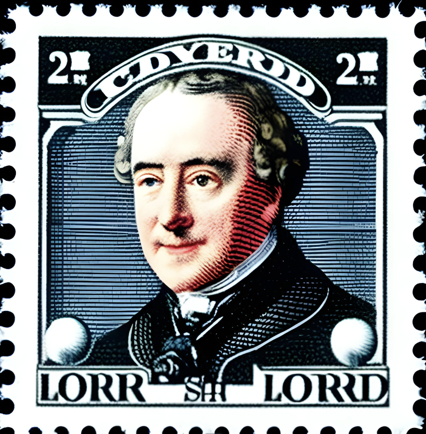
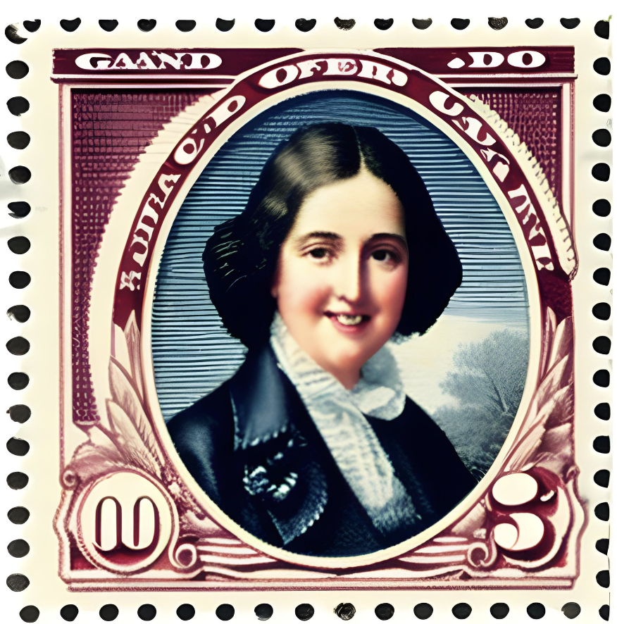
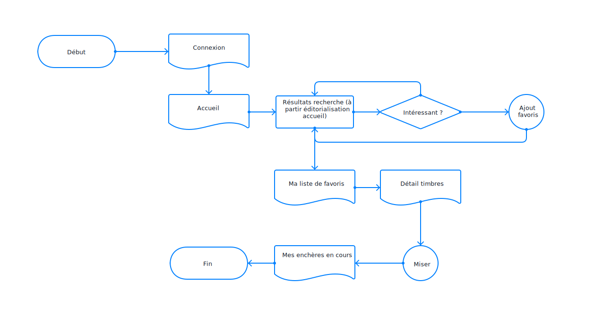
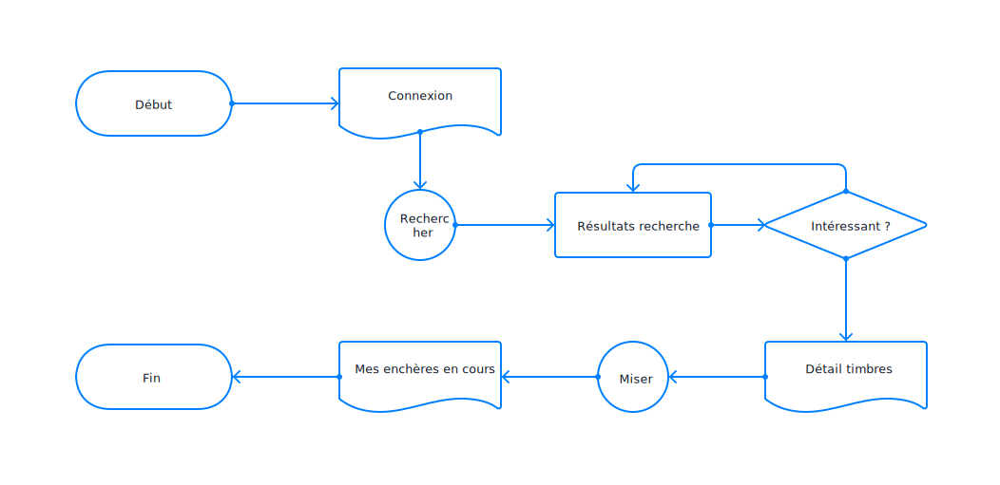
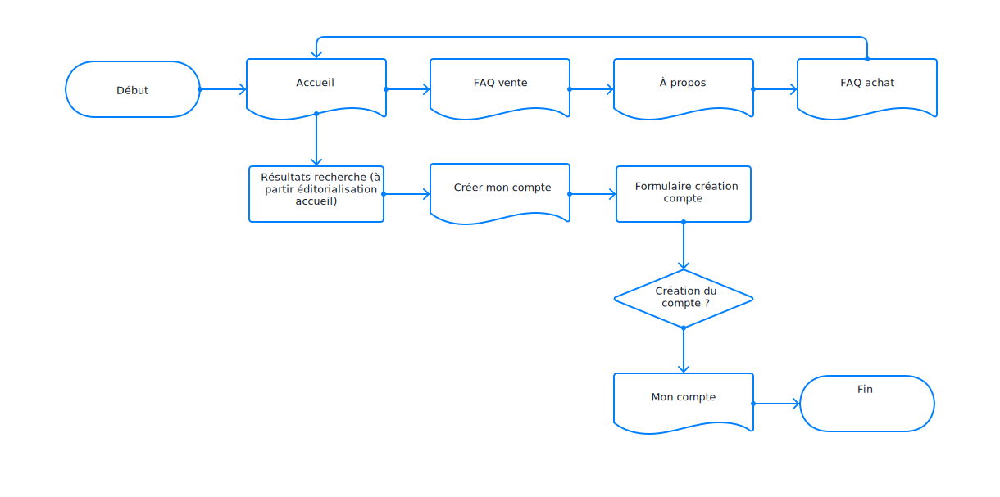
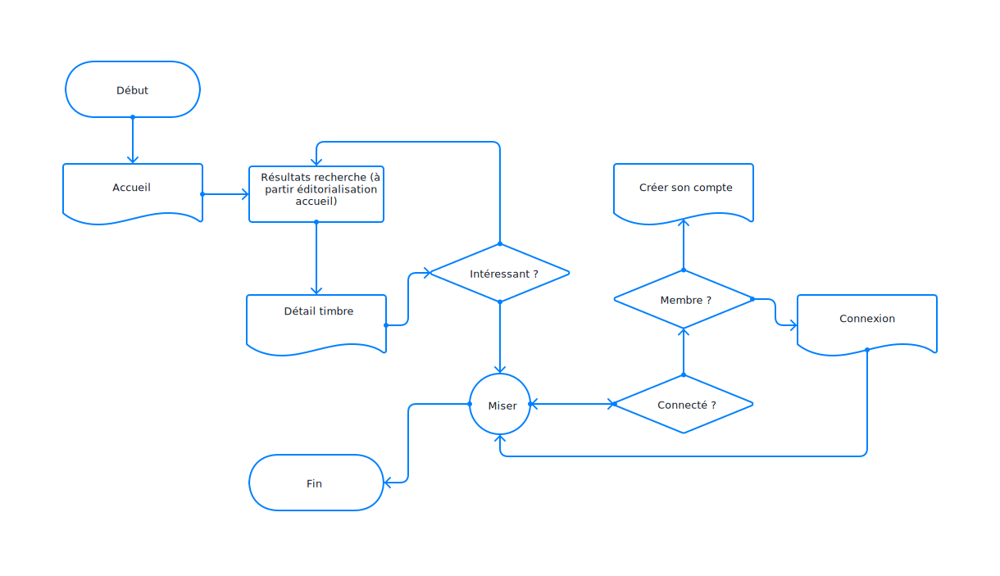

# Personas

## Le collectionneur chevronné, membre d'élite du club Stampee et fier de l'être

### Profil
**Nom** : Lord William Cavendish
**Âge** : 65 ans
**Profession** : Rentier

**Humeur** : 
William est un joyeux luron, mais il déteste passer à côté d'une enchère. Quand William veut acquérir un timbre, mieux vaut ne pas se trouver sur son chemin.

**Degré de compétences technologiques** : 
Tant qu'on ne lui parle pas de réseaux sociaux, William est assez à l'aise avec la technologie. Il possède un smartphone, un ordinateur et une tablette de dernière génération. Il préfère tout de même consulter la version desktop des sites internet plutôt que leurs applications mobiles. C'est son côté 'old school'.

### Introduction
Lord William Cavendish est un lord de la noblesse anglaise qui a travaillé toute sa vie en tant que banquier avant de devenir rentier. Sa famille est connue pour être amatrice de timbres et William est un philatéliste passionné depuis son enfance. Il a une impressionnante collection de timbres rares du monde entier, dont quelques-uns font sa fierté auprès des autres collectionneurs. Depuis qu'il a plus de temps pour se consacrer à sa passion, il participe à toutes les enchères des environs et est un fervent utilisateur des sites d'enchères de timbres en ligne. Il a toujours en tête quelques raretés qu'il aimerait ajouter à sa collection.

### Objectifs et enjeux
William prend la philatélie très au sérieux et est très fier de sa collection personnelle. Il souhaite être le premier au courant des nouvelles enchères et ne pas passer à côté de la perle rare. Il est prêt à enchérir des grosses sommes pour ajouter des timbres à sa collection. Il aime faire partie de la communauté des membres du club Stampee et prend plaisir à rendre les autres membres jaloux de sa collection.

### Contexte et fréquence de visite
William se rend sur le site Stampee au moins une fois par jour. Il aime faire son petit tour des nouveautés et voir l'évolution des enchères en cours. Le site lui est très familier et il a ses habitudes de navigation. Lorsqu'il enchérit sur un timbre il souhaite absolument remporter l'enchère et il peut donc revenir plusieurs fois par jour sur le site pour surveiller l'avancement des enchères.

### Appareils utilisés
William est un rentier très actif et souvent en déplacement pour rendre visite aux membres de sa famille très nombreuse. Que ce soit quand il se déplace en hélicoptère, en jet ou à cheval, William aime consulter sa tablette pour jeter un oeil à Stampee. Quand il est chez lui, William consulte le site dans son bureau art déco à partir de son macbook 88 pouces. 

### Applications utilisées
William n'utilise pas tellement les applications que ses petits-enfants lui ont installés sur son cellulaire.

---

## La collectionneuse du dimanche, s'y intéresse quand elle trouve le temps. 

### Profil
**Nom** : Cassandra Johnson
**Âge** : 30 ans
**Profession** : Artiste céramique

**Humeur** : 
Cassandra est une femme très occupée qui aime que les choses soient efficaces. Elle aime le côté manuel de son travail et n'aime pas perdre son temps sur internet. 

**Degré de compétences technologiques** : 
Cassandra utilise tous les jours son cellulaire mais peut se passer plus facilement de son ordinateur pendant plusieurs jours. Elle ne possède pas de tablette.

### Introduction
Cassandra a été introduite au monde de la philatélie quand elle était jeune grâce à son grand-père et son père qui avait tous deux une collection. Petite, elle s'amuse à dénicher ses premiers timbres pour faire comme son grand-père. Mais petit à petit elle perd l'intérêt et ne s'occupe plus et laisse ce hobby de côté. À la mort de son grand-père elle hérite de toute sa collection qui contient de nombreux timbres de valeurs. En mémoire à son grand-père elle se replonge de temps en temps dans sa collection et aime consulter les enchères en ligne et suivre de loin cette communauté. Elle se demande si la collection de son grand-père devrait rester dans la famille ou si quelqu'un d'autre n'en profiterai pas mieux.

### Objectifs et enjeux
Cassandra souhaite parcourir rapidement les nouveautés ou événements particuliers pour se sentir encore connectée à son grand-père à travers sa passion. Elle serait aussi intéressée à obtenir de l'information sur la vente de timbres.

### Contexte et fréquence de visite
Elle ne visite le site que ponctuellement quand elle a du temps à perdre en ligne. Depuis qu'elle s'est replongée dans le monde de la philatélie, elle se demande si ce serait une bonne idée de partager cette passion avec d'autres membres de sa famille, comme son grand-père l'avait fait avec elle. Elle regarde donc de temps en temps les enchères autant pour acheter, que pour se rendre compte de la valeur de la collection dont elle a hérité.

### Appareils utilisés
Elle utilise principalement son cellulaire pour consulter les sites d'enchères.

### Applications utilisées
Elle utilise des applications de réseaux sociaux comme instagram pour faire la promotion de ses créations. Elle utilise également la version application des sites qu'elle visite régulièrement. Le fait de recevoir des notifications directement sur son téléphone est plus pratique selon elle.

---

# Parcours utilisateurs

## Le collectionneur assidu magasine
William se connecte à son compte et va voir s'il y a des nouveautés intéressantes. Après les avoir toutes passées en revue et les avoir ajoutées à sa liste de surveillance, il peut commencer à enchérir. Un dernier coup d'oeil à la liste de ses enchères en cours et il est satisfait de son petit tour quotidien.

## Le collectionneur assidu enchéri
William se connecte à son compte et recherche directement le timbre qu'il est venu acquérir. Directement à partir des résultats de recherche il mise dessus. Il vérifie sa liste d'enchères en cours et se déconnecte. Il viendra vérifier plusieurs fois dans la journée où en est son enchère.

## La collectionneuse du dimanche découvre Stampee
Après avoir fait le tour des sites d'enchères de timbres en ligne, Cassandra tombe rapidement sur Stampee. Elle fait un tour sur l'accueil et se renseigne sur les modalités de vente. Après avoir vérifié que Stampee est une organisation sérieuse, elle regarde par curiosité comment fonctionne les enchères en ligne en tant qu'acheteur. À partir de l'accueil elle découvre le genre de timbres et de collections qui sont mises en vente sur ce site. Elle se créé un compte et arrête pour le moment la navigation. Elle y reviendra plus tard quand elle aura plus de temps.

## La collectionneuse du dimanche magasine
Cassandra ne recherche pas quelque chose en particulier mais est venue voir qu'elle genre de timbres sont en vente en ce moment. L'Accueil lui propose quelques collections et enchères en cours qui sont mises de l'avant. En naviguant à partir de ces propositions, elle découvre différents timbres et leurs détails. Quand elle essaie de miser sur un timbre particulièrement intéressant, elle est invitée à se connecter à son compte. Une fois la mise validée, elle est satisfaite et se déconnecte avant d'être tentée de miser sur trop d'enchères en même temps.

