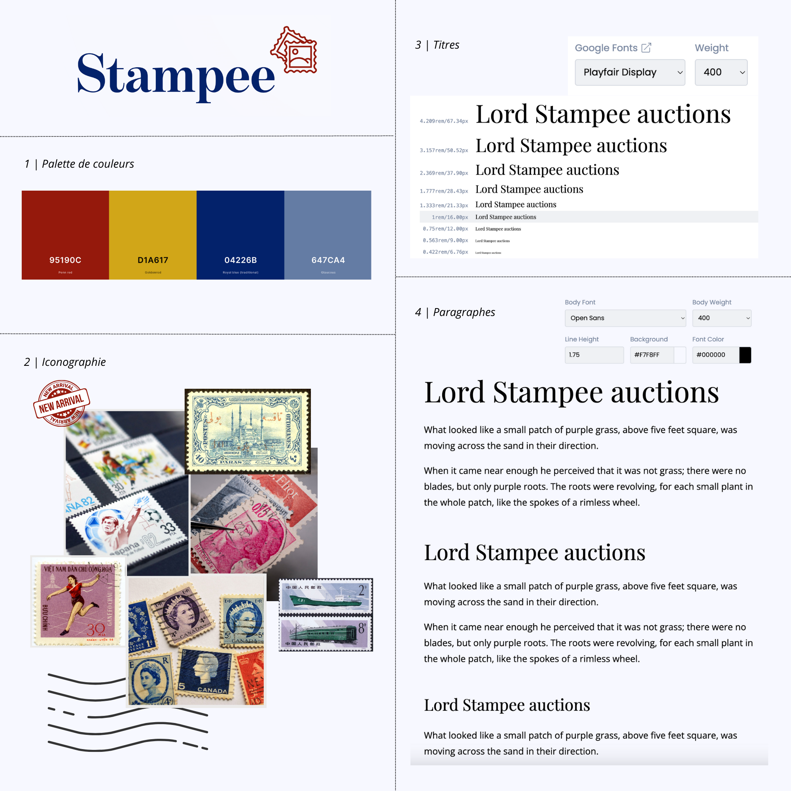
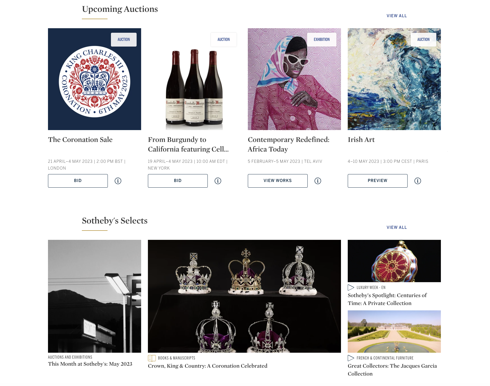
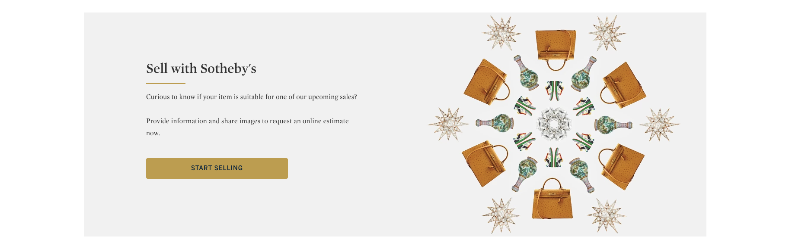
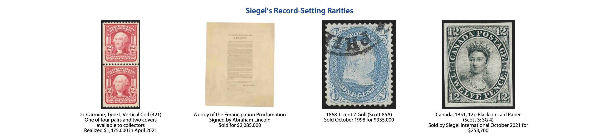
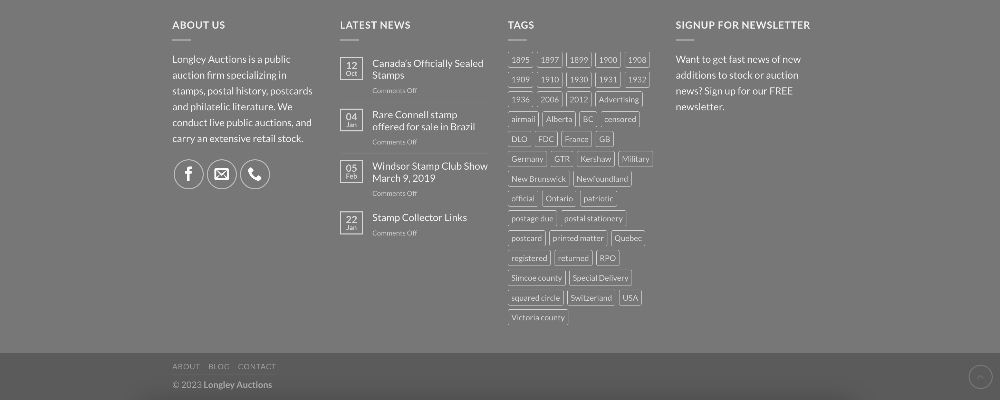
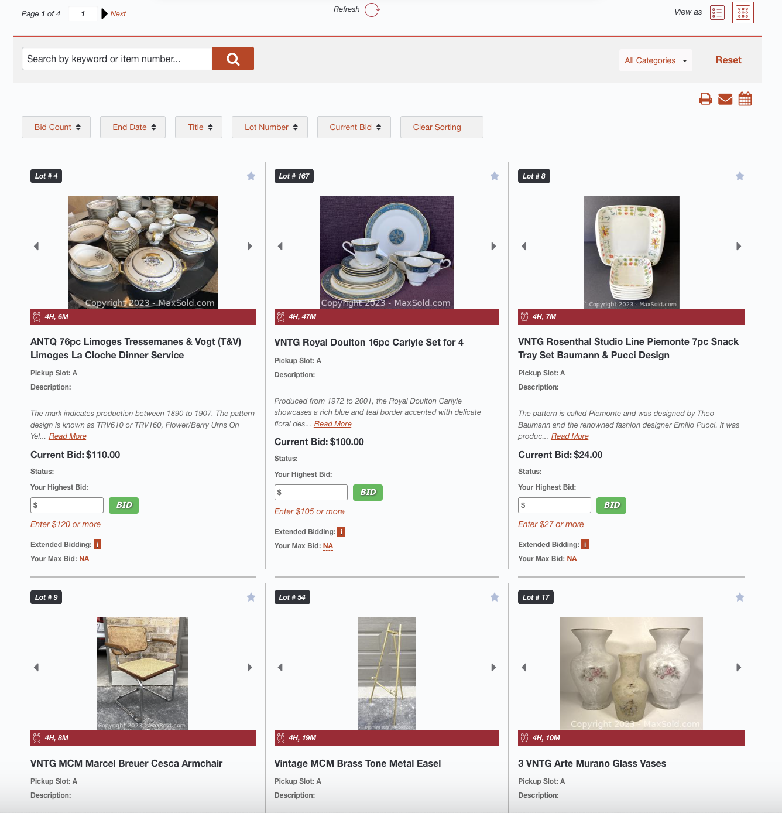
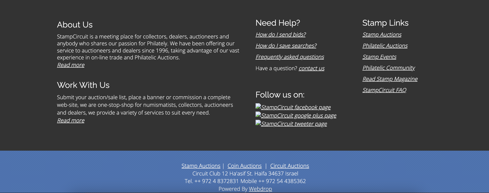

## 1. Moodboard

###### Sources :
https://colorkit.co
https://typescale.com/
https://fontjoy.com/
https://fontsinuse.com/

****

## 2. Mashup inspiration

### Page d'accueil

###### Sources :
- Double menu [David Feldman](https://www.davidfeldman.com/)
- Barre recherche [Old bid](https://oldbid.com/)
- Catégories vedettes [Sothebys](https://www.sothebys.com/en/)
- Catégories vedettes [Siegel](https://siegelauctions.com/)
- Footer [Longley](https://longleyauctions.com/)

****

### Page catalogue

###### Sources :
- Double menu [Sothebys](https://www.sothebys.com/en/)
- Catalogue [Maxold](https://maxsold.maxsold.com/auction/81698/bidgallery/)
- Footer [Stamp circuit](https://www.stampcircuit.com/)